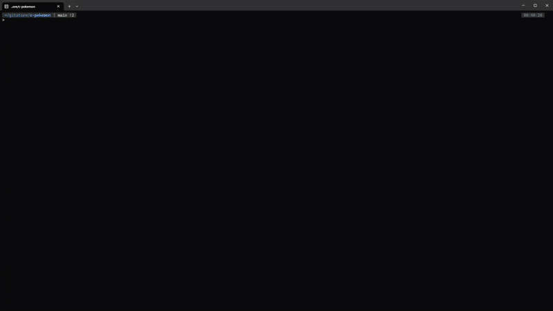

# C-Pokemon 

> A retro-style Pokemon game written in C using ncurses



## 🚀 Quick Start

### Requirements
- **Operating System**: Linux
- **Terminal Size**: Minimum 63x236 characters (63 lines, 236 columns)
- **Dependencies**:
  - `libncurses5-dev` (required)
  - `vlc` (optional, for music)

### Installation

```bash
# Install required dependencies
sudo apt-get install libncurses5-dev

# Optional: Install VLC for music support
sudo apt-get install vlc

# Navigate to the game directory
cd c-pokemon/

# Compile and run
make
```

### Manual Compilation (if make fails)
```bash
gcc -o c-pokemon src/game.c src/talkbis.c src/talk.c src/physic.c src/main.c src/print.c -lncurses
./c-pokemon
```

## 🎵 Music Setup

Unfortunately, due to storage issues, music playback is not integrated directly into the game.

## 🎯 Display Settings

- **Minimum terminal size**: 63x236 characters
- **Zoom controls**: `Ctrl + -` (zoom out) / `Ctrl + +` (zoom in)
- **Recommended**: Play in fullscreen mode (`F11`)

## 🎮 Controls

### Movement
- **Forward**: `Z` or `↑`
- **Backward**: `S` or `↓`
- **Right**: `D` or `→`
- **Left**: `Q` or `←`

### Game Actions
- **Interact**: `E` or `Enter`
- **Inventory**: `I` (context-dependent)
- **Menu**: `M` (context-dependent)
- **Back/Cancel**: `Spacebar`
- **Plant flower**: `P` (special action on league road)

### Getting Started
At the beginning, you'll choose between three starter Pokemon:
- **Charmander** (Salamèche) 🔥
- **Squirtle** (Carapuce) 💧
- **Bulbasaur** (Bulbizarre) 🌱

You'll start your adventure in **Bourgpalette** town, free to explore and discover!

### Core Gameplay
- **Catch Pokemon**: Explore the forest and catch wild Pokemon to build your team
- **Train Your Team**: Use CT (Capsule Technique) to teach moves, potions to heal, and candies to level up
- **Battle System**: Your first 3 Pokemon form your battle team for fights
- **Ultimate Goal**: Defeat the League Champions (Blue, Red, and Yellow)

### Key Locations
- **Your Home**: Visit your helpful mom
- **Pokemon Lab**: Talk to Professor Chen to learn CT moves, use the PC to store Pokemon (20 slots + 6 in pocket)
- **Shop**: Buy items, CT moves, and supplies
- **League**: Challenge the elite trainers

### Interface
- **Inventory (`I`)**: Manage items, heal Pokemon with potions, use candies for leveling
- **Menu (`M`)**: View trainer stats, XP, money, save/quit game, manage your Pokemon team
- **Team Management**: Rearrange Pokemon order, release unwanted Pokemon

### Security Note
🔒 Don't share your lab computer login credentials - others could steal your Pokemon!

## 🕹️ Gameplay


## 🐛 Known Issues

- **Rare flower bug**: Occasionally when picking flowers, the wrong flower may be collected (occurs ~1/50 times). Simply interact again to pick the correct flower.

## 🎖️ Achievement

**Grade**: 20/20
**Ranking**: 1st out of 323 students

## 🙏 Acknowledgments

- **Amine Zahaf** - Friend and advisor, essential team management guidance
- **Romuald Grignon** - Teacher and inspiration, technical guidance and support
- **Eva Ansermin** - Teacher, provided the map concept and continuous encouragement

## 👨‍💻 Credits

**Development Team:**
- Adam Terrak
- Ayman Ouguerd
- Abdelah El Harsal

## 📧 Contact

- contact@adamterrak.me
- aymanouguerd@gmail.com
- abdelah.elharsal@gmail.com

---

**Gotta catch 'em all!** 🎯